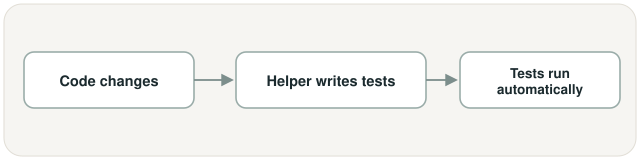

# Payment Compliance & Exception Copilot, in a nutshell

## What is this?

A computer program that looks at a bank payment that got stuck while moving between
two countries, figures out what's wrong with it, checks it against the rules, and
writes a plain-English explanation of what should happen to it next.

## What problem does it solve?

When a payment between two countries gets stuck or flagged, a real person currently
has to read through its details by hand, dig through rulebooks and watch lists,
decide whether to release it, block it, or ask for help, and then write up why — for
every single stuck payment. That's slow, and it's easy for two different people to
make two different calls on the same kind of payment. This project does that first
pass automatically, but in a way that always shows its work: think of a bank employee
who double-checks a wire transfer before it goes out, except this one writes down
exactly which rule it checked, every single time, so someone else can verify it later.

## How it works (simple version)

In words: a stuck payment comes in → the system looks up the actual rulebook pages
that apply to this kind of payment → it figures out *why* the payment got stuck (a
form left blank, a risky country pairing, it's been sitting too long, it looks like a
repeat of another payment) → it checks the payment against real compliance rules and
watch lists, always by reading the actual documents, never by guessing → it decides:
let it through, block it, or hand it to a human → either way, it writes a
plain-English report explaining the decision and exactly which rule it used.

**Output:** a report a compliance officer could read and trust, with proof for every
claim in it.

Separately, and unrelated to any of the above — a second small helper watches the
project's own computer code, not payments:

This part has nothing to do with payments — it just helps keep the project itself
from quietly breaking.

## Plain-English glossary

- **Cross-border payment** — money moving from a bank account in one country to a
  bank account in another.
- **Flagged / stuck payment** — a payment that got stopped partway through because
  something about it looked wrong, incomplete, or risky.
- **Compliance** — the rules a business has to follow, especially rules about not
  helping move money for criminals or sanctioned people, companies, or countries.
- **Sanctions list** — a government's list of people, companies, or countries nobody
  is allowed to send money to.
- **AML (anti-money-laundering) rules** — rules meant to stop criminals from
  disguising illegally-earned money as legitimate money.
- **Escalate** — instead of deciding yes or no on its own, the system hands the
  decision to a human.
- **Citation** — a note saying exactly which rule or document a decision was based
  on, so someone can double-check the system's work.
- **Audit trail (decision log)** — a permanent, unchangeable written record of every
  step the system took and why, kept even after the final report is written — if the
  report and this record ever disagreed, the record would be the one to trust.
- **Retrieval (sometimes called "RAG")** — before answering anything, the system
  looks up the real, actual rulebook or document first, instead of just guessing from
  memory.
- **Agent** — one focused part of the system that does a single job — for example,
  one whole part's only job is figuring out *why* a payment got stuck.
- **Pipeline** — the fixed order the different parts work in, each one handing its
  findings to the next, like an assembly line.
- **Corridor** — the specific pair of countries or currencies a payment is moving
  between — for example, a payment going from a Euro account to a British Pound
  account.
- **ISO 20022 (pain.001)** — the standard electronic form banks use to describe a
  payment: who's paying whom, how much, and why — like a standardized invoice format
  every bank can read the same way.
