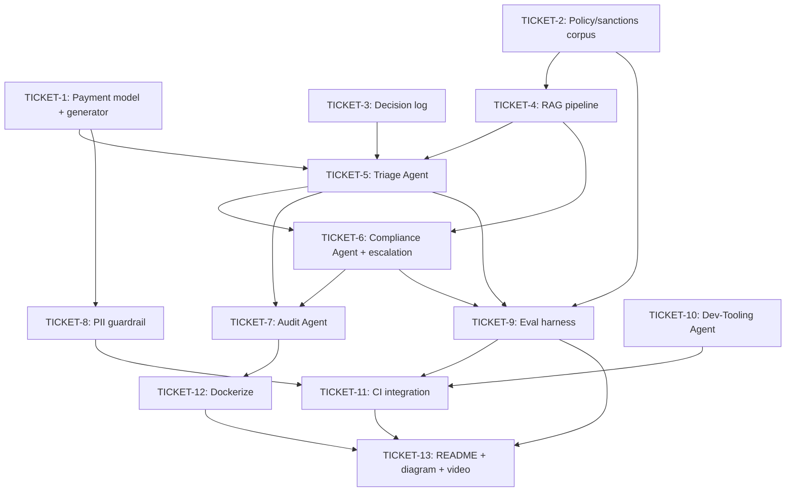

# Spec: Payment Compliance & Exception Copilot

## Epic summary

Build a multi-agent, RAG-grounded system that triages a flagged/stuck cross-border payment, checks it against compliance rules with cited sources, and produces a human-readable audit report — plus a separate Dev-Tooling Agent that generates tests for the codebase itself in CI. Entire system must run at zero infrastructure cost (local models, local vector store, local containers). Source: `docs/PRD_Payment_Compliance_Exception_Copilot.md`.

This is a greenfield project (no existing source tree yet — only `pyproject.toml` and tooling scaffolding). Tickets below map to the PRD's four Implementation Phases (Section 11), sliced finer for PIV-sized execution.

## Tickets

### TICKET-1 — Payment data model + synthetic ISO 20022 message generator
- **Scope:** Define the payment record schema (payment ID, source/destination currency, corridor, amount, timestamp, ISO 20022 XML payload, status, flag reason). Build a generator that produces synthetic `pain.001`-style payment messages with a range of plausible flag reasons (missing/malformed field, compliance hold, corridor/currency issue, timeout, duplicate).
- **Acceptance criteria:**
  - A `Payment` model/schema exists and is used consistently across the repo.
  - Generator produces valid-shaped `pain.001` XML for at least 5 distinct flag-reason scenarios.
  - Generated payments are loadable by downstream code as structured objects, not just raw XML.
- **Files touched (estimate):** `/data/synthetic_payments/`, a `payment` model module, a message-generator script/module, unit tests.
- **Depends on:** none

### TICKET-2 — Synthetic policy, sanctions, and jurisdiction document corpus
- **Scope:** Author the mock internal policy documents, mock sanctions/watchlist entries (clearly watermarked as fictional), and mock jurisdiction-specific corridor rules (e.g., "EUR→GBP corridor requires X") that the RAG layer will ingest. Include real ISO 20022 `pain.001` field-spec docs (public schema) in the corpus.
- **Acceptance criteria:**
  - Policy/sanctions/jurisdiction documents exist as versioned markdown/text files.
  - At least one document directly supports each flag-reason scenario from TICKET-1, so Triage/Compliance have something concrete to retrieve and cite.
  - Sanctions entries are clearly labeled synthetic/fictional in-file.
- **Files touched (estimate):** `/data/policy_docs/`, `/data/sanctions_mock/`.
- **Depends on:** none (parallel with TICKET-1)

### TICKET-3 — Append-only agent decision log
- **Scope:** Build the decision-log component that records every agent's input, retrieved context, decision, and reasoning, append-only. This is the audit trail's source of truth (reports render it, they don't replace it).
- **Acceptance criteria:**
  - A `log_decision(...)`-style API exists that any agent can call with input/context/decision/reasoning.
  - Entries are immutable once written (append-only, no update/delete path).
  - A stored entry can be retrieved by payment ID and returns all agent invocations for that payment in order.
- **Files touched (estimate):** decision-log module, storage backend (local file or SQLite), unit tests.
- **Depends on:** none (parallel with TICKET-1, TICKET-2)

### TICKET-4 — RAG ingestion, embedding, and retrieval pipeline (Chroma)
- **Scope:** Build the pipeline that chunks and embeds the document corpus from TICKET-2 into a local, file-based Chroma vector store, plus a retriever interface agents will call.
- **Acceptance criteria:**
  - Running ingestion against the TICKET-2 corpus produces a queryable local Chroma store.
  - A `retrieve(query, k)`-style function returns ranked chunks with enough metadata (source doc, chunk id) to support citation.
  - Retrieval quality spot-checked: querying for a known scenario (e.g., "EUR→GBP corridor rule") returns the relevant chunk in the top results.
- **Files touched (estimate):** `/rag/ingestion/`, `/rag/embeddings/`, `/rag/retriever.py`.
- **Depends on:** TICKET-2

### TICKET-5 — Triage Agent
- **Scope:** Implement the agent that classifies why a flagged payment needs attention, grounded in RAG retrieval, never guessing from parametric memory alone.
- **Acceptance criteria:**
  - Given a payment + processing log, agent retrieves relevant docs via TICKET-4's retriever before classifying.
  - Output schema includes: cause classification, confidence, and at least one citation (source doc + chunk id) — an output without a citation is treated as invalid.
  - Every invocation is recorded via TICKET-3's decision log.
  - Correctly classifies all 5 flag-reason scenarios from TICKET-1 in a manual/scripted check.
- **Files touched (estimate):** `/agents/triage_agent.py`, unit tests.
- **Depends on:** TICKET-1, TICKET-4, TICKET-3

### TICKET-6 — Compliance Agent + escalate-by-default enforcement
- **Scope:** Implement the agent that checks a payment (plus Triage output) against sanctions/AML/jurisdiction policy via RAG and decides Clear / Block / Escalate, with the risk-threshold escalation ceiling enforced outside the LLM call.
- **Acceptance criteria:**
  - Decision schema requires a cited rule/document; no unattributed Clear/Block decisions.
  - Any decision whose computed risk score exceeds a configurable threshold is force-overridden to "Escalate" by code, not by prompting the model — this override is unit-tested directly (mock a high-risk case and assert the final decision is Escalate regardless of the raw agent output).
  - Correctly blocks all known-sanctioned synthetic test entities from TICKET-2 (target: 20/20 or documented equivalent).
  - Every invocation recorded via TICKET-3's decision log.
- **Files touched (estimate):** `/agents/compliance_agent.py`, risk-threshold config, unit tests.
- **Depends on:** TICKET-4, TICKET-5

### TICKET-7 — Audit / Report Agent
- **Scope:** Implement the agent that synthesizes Triage + Compliance outputs (including citations and reasoning traces) into a structured, plain-English Markdown report per payment.
- **Acceptance criteria:**
  - Given a processed payment's Triage + Compliance output, produces a Markdown report with cause, decision, and every citation carried through from upstream agents (not summarized away).
  - Report is legible to the "compliance analyst" persona without needing to consult source documents directly.
  - End-to-end: a synthetic flagged payment run through Triage → Compliance → Audit produces a complete report with visible citations at each step.
- **Files touched (estimate):** `/agents/audit_agent.py`, report template, unit/integration tests.
- **Depends on:** TICKET-5, TICKET-6

### TICKET-8 — PII masking guardrail + red-team test
- **Scope:** Implement the ingestion-layer guardrail that tokenizes/masks all raw account numbers, names, and identifiers before any payment data reaches an LLM prompt. Add a red-team-style test that feeds a payment with embedded PII and asserts the LLM never receives or outputs it.
- **Acceptance criteria:**
  - Masking happens at the data-ingestion boundary, before any agent call — verified by inspecting the actual prompt sent to the LLM in a test, not just the final output.
  - Red-team test passes and is runnable standalone (`pytest` target) as well as in CI.
  - Zero raw PII observed in LLM prompts/outputs across the guardrail test suite.
- **Files touched (estimate):** `/guardrails/pii_masking.py`, `/guardrails/tests/`.
- **Depends on:** TICKET-1

### TICKET-9 — Evaluation harness (RAGAS) with published results
- **Scope:** Build the eval harness measuring retrieval precision/faithfulness for Triage and Compliance agents, and Compliance Agent accuracy against a hand-labeled synthetic test set.
- **Acceptance criteria:**
  - Harness runs against the live Triage/Compliance agents and the TICKET-4 retriever, producing numeric results (not just pass/fail).
  - A hand-labeled test set exists (derived from TICKET-2's sanctions/policy corpus) with known-correct answers.
  - Results are written to a machine-readable output (e.g., JSON) suitable for pasting into the README.
- **Files touched (estimate):** `/eval/ragas_harness.py`, `/eval/labeled_test_set/`.
- **Depends on:** TICKET-5, TICKET-6, TICKET-2

### TICKET-10 — Dev-Tooling Agent (test generation)
- **Scope:** Implement the agent that operates on the codebase itself — generating unit tests for new/changed functions in the agent codebase, independent of the payments-reasoning pipeline.
- **Acceptance criteria:**
  - Given a diff/set of changed functions, agent generates unit tests that at minimum import and exercise the changed function without error.
  - Generated tests are written to the correct test path convention for the repo and are runnable via `pytest`.
  - Clearly documented as operating on the codebase, not on payment data (no RAG/citation requirement here — different contract from TICKETS 5-7).
- **Files touched (estimate):** `/agents/dev_tooling_agent.py`, unit tests.
- **Depends on:** none (independent track — can run in parallel with the entire payments-reasoning branch)

### TICKET-11 — GitHub Actions CI integration
- **Scope:** Wire the Dev-Tooling Agent, the PII guardrail test suite, and the eval harness into GitHub Actions so they run on every PR, reporting pass/fail and coverage.
- **Acceptance criteria:**
  - A PR against the repo triggers CI.
  - CI runs the Dev-Tooling Agent against the PR's diff, runs the generated tests, and reports coverage.
  - CI also runs the TICKET-8 guardrail test suite and fails the build if it fails.
  - Workflow file is committed and demonstrably green on a real PR.
- **Files touched (estimate):** `.github/workflows/ci.yml`.
- **Depends on:** TICKET-8, TICKET-9, TICKET-10

### TICKET-12 — Dockerize (Docker Compose, local)
- **Scope:** Containerize the full pipeline (agents, RAG store, Ollama local model) so the entire system starts with a single `docker compose up`, zero cloud cost.
- **Acceptance criteria:**
  - `docker compose up` starts the full pipeline locally with no external paid dependency.
  - Running a synthetic payment through the containerized system produces the same report as running it locally outside Docker.
  - Optional free-tier cloud deployment (Render/Railway) is noted as a stretch goal, not required for this ticket's completion.
- **Files touched (estimate):** `/infra/Dockerfile`, `/infra/docker-compose.yml`.
- **Depends on:** TICKET-7

### TICKET-13 — Architecture diagram, README, and walkthrough
- **Scope:** Write the README explaining the "why" (agentic AI vs. deterministic systems, tying to the author's Smart Routing background), publish the architecture diagram, and record a short walkthrough video. Publish eval numbers (TICKET-9) and guardrail proof (TICKET-8) in the README with actual numbers.
- **Acceptance criteria:**
  - README explicitly discloses this is a portfolio simulation with synthetic data, not a production compliance system.
  - README includes the published eval numbers and a description of the guardrail test, not just claims.
  - Architecture diagram matches the as-built system (update if it drifted from the PRD's Section 6.1 diagram during implementation).
- **Files touched (estimate):** `README.md`, `/docs/architecture-diagram.*`.
- **Depends on:** TICKET-9, TICKET-11, TICKET-12

## Dependency graph

## Suggested execution order

- **Wave 1 (parallel):** TICKET-1, TICKET-2, TICKET-3, TICKET-10
- **Wave 2 (parallel):** TICKET-4 (needs TICKET-2), TICKET-8 (needs TICKET-1)
- **Wave 3:** TICKET-5 (needs TICKET-1, TICKET-3, TICKET-4)
- **Wave 4:** TICKET-6 (needs TICKET-4, TICKET-5)
- **Wave 5 (parallel):** TICKET-7 (needs TICKET-5, TICKET-6), TICKET-9 (needs TICKET-2, TICKET-5, TICKET-6)
- **Wave 6:** TICKET-11 (needs TICKET-8, TICKET-9, TICKET-10), TICKET-12 (needs TICKET-7) — these two are mutually independent and can run in parallel
- **Wave 7:** TICKET-13 (needs TICKET-9, TICKET-11, TICKET-12)

TICKET-10 (Dev-Tooling Agent) is fully independent of the payments-reasoning branch (TICKET-1/4/5/6/7/9) and can be built and merged at any point before TICKET-11 needs it — good candidate to run in its own worktree in parallel with the main branch.
