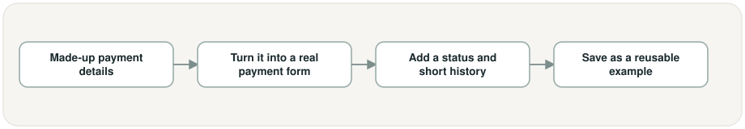
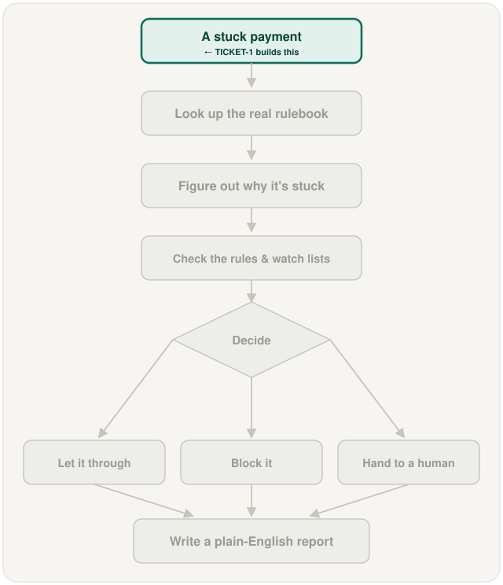

# Payment data model + example payments, in plain words

## What is this task?

This task builds the made-up, practice payments the rest of the project needs — each
one shaped like a real stuck payment between two countries, but entirely fictional.

## Why does it exist?

Before this task, the project had no example payments at all — nothing for any later
part of the system to look at, check, or learn from. Every later step needs a
realistic stuck payment to work on, and it needs to already know the "correct answer"
for each one (why it's actually stuck), so its work can be checked.

## What changes because of it?

The project now has five solid example payments, each one deliberately stuck for a
different, clearly labeled reason. Nothing about deciding, checking against rules, or
writing reports exists yet — this task only builds the raw material everything else
will run on.

## This task's own workflow



In words: someone decides on the details of a made-up payment (who's paying whom, how
much, what's supposedly wrong with it) → that gets turned into a real-looking payment
form, the same kind of form real banks use → it gets wrapped with a status ("stuck" or
"flagged") and a short written history of what happened to it → the whole thing is
saved as a reusable example file.

## Where it fits in the whole project



The rest of the project's flow (looking up the rulebook, figuring out why a payment is
stuck, deciding what to do, writing the report) is shown greyed out on purpose — none
of it exists yet. This task only builds the very first box: the stuck payment itself,
the thing every later step will eventually work on.

## Screenshots

This task has no screen or app to photograph yet — it's the data underneath
everything else, not something with a visible interface. What follows is the real,
actual output of running it just now (a terminal readout, not a picture of an app):

```
$ uv run python -m data.generate_synthetic_payments
(produces 5 example payment files, no printed output)

$ uv run python -c "from data.loader import load_all
for p in load_all():
    print(p.payment_id, '|', p.flag_reason.value, '|', p.status.value, '|', p.corridor, '|', p.amount)"

PMT-0001 | missing_malformed_field | flagged | EUR-EUR | 4250.00
PMT-0002 | compliance_hold        | flagged | USD-USD | 18900.00
PMT-0003 | corridor_currency_issue| flagged | EUR-GBP | 7600.50
PMT-0004 | timeout                | stuck   | USD-CHF | 52300.00
PMT-0005 | duplicate              | flagged | EUR-EUR | 3120.75
```

Five example payments, five different reasons for being stuck, exactly as intended.

## New terms this task introduces

- **Example payment (synthetic)** — a made-up, fictional payment record used only for
  building and testing the project — never a real bank transaction, never real money.
- **Reusable example file** — a saved copy of one example payment that always looks
  exactly the same every time it's opened, so later parts of the project (and their
  tests) always have something reliable to check their work against.
