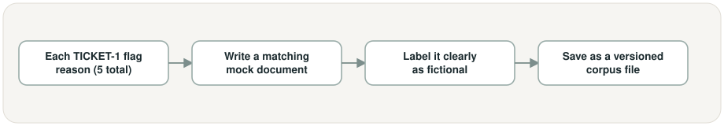
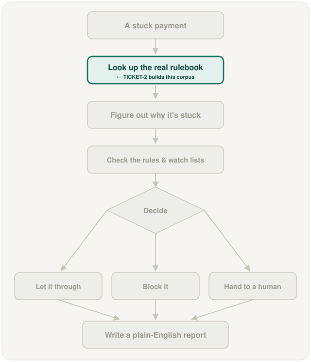

# Synthetic policy, sanctions, and jurisdiction document corpus, in plain words

## What is this task?

This task writes the made-up rulebook the project will look things up in — mock
policy documents, mock sanctions entries, and mock country-pair rules, each clearly
labeled as fictional, plus the real, publicly published ISO 20022 `pain.001`
documents that define what each field on a payment form actually means.

## Why does it exist?

Before this task, there was nothing for the system to actually look anything up in —
no rulebook, no watch list, no corridor rules. Every later step that's supposed to
check a payment against real documents (instead of just guessing) needs those
documents to already exist, and needs at least one document that directly explains
each of the five stuck-payment reasons from TICKET-1.

## What changes because of it?

The project now has a real, if fictional, document library to search — the raw
material the retrieval step (TICKET-4) will load into its lookup index. Nothing about
searching, deciding, or reporting exists yet; this task only builds the shelf of
documents everything else will read from.

## This task's own workflow

In words: start from each of TICKET-1's five stuck-payment reasons → write a mock
document that would actually explain that reason (a policy rule, a sanctions entry, or
a corridor rule) → label it clearly as fictional so nobody mistakes it for a real
policy → save it as a versioned file in the document corpus.

## Where it fits in the whole project

The rest of the flow is greyed out because none of it exists yet, including the
payment itself (TICKET-1 built that separately). This task builds the second box: the
document corpus that "look up the real rulebook" will eventually search — nothing can
be looked up until this shelf of documents exists.

## Screenshots

This task has no screen or app to photograph — it produces text/markdown files on
disk, not a running program. Nothing runnable exists yet for this task; the two
diagrams above are the workflow view for now.

## New terms this task introduces

- **Document corpus** — the whole collection of documents (policy, sanctions,
  jurisdiction rules) the system is allowed to search through.
- **Corridor rule** — a rule written for one specific pair of countries or
  currencies, e.g. "a Euro-to-Pound payment needs extra proof of the sender."
- **Watermarked as fictional** — a document clearly marked inside itself as made-up,
  so it's never mistaken for a real policy, law, or sanctions list.
