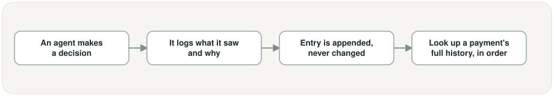

# Append-only agent decision log, in plain words

## What is this task?

This task builds the actual recorder behind the project's audit trail — a place every
future agent writes to every time it makes a decision, and that record can never be
edited or deleted afterward.

## Why does it exist?

The whole project's core promise is that every decision can be checked later against
the exact rule it was based on. Without a real place to write that down as it
happens, later agents (Triage, Compliance, Audit) would have nowhere durable to
record "here's what I saw, here's what I decided, here's why" — and the final report
would just be a claim nobody could verify.

## What changes because of it?

The project now has one shared, permanent record that any future agent can write to
and any future report can read from — but no agents exist yet to actually use it.
This task only builds the recorder itself, ready and waiting for TICKET-5
(Triage Agent) and TICKET-6 (Compliance Agent) to start writing to it.

## This task's own workflow

In words: an agent makes a decision → it logs what it saw and why → that entry is
appended to the record and can never be changed afterward → later, anyone can look up
a specific payment's full history of decisions, in the order they happened.

## Where it fits in the whole project

Unlike TICKET-1 and TICKET-2, this task doesn't build one step *in* the payment flow
— it builds something every decision-making step *writes to* alongside the flow,
shown here as the highlighted box every arrow points into.

## Screenshots

This task has no screen or app to photograph yet — it's a backend recording
component, not something with a visible interface. Nothing runnable exists for this
task yet; the two diagrams above are the workflow view for now.

## New terms this task introduces

- **Append-only** — a record that can only ever have new entries added to it; nothing
  already written can be changed or removed, so the history it holds can't be quietly
  rewritten later.
