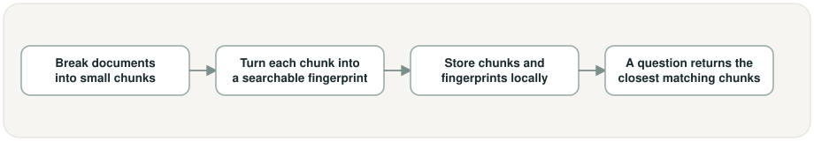
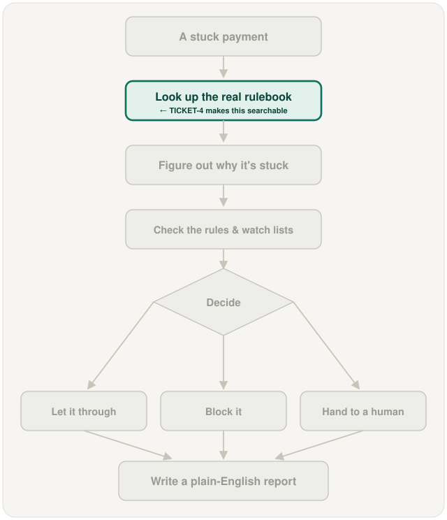

# RAG ingestion, embedding, and retrieval pipeline, in plain words

## What is this task?

This task builds the actual search engine behind "look up the real rulebook" —
it breaks TICKET-2's documents into small searchable pieces, turns each piece
into a form a computer can compare for similarity, and stores them so any
later agent can ask a question and get the most relevant pieces back.

## Why does it exist?

TICKET-2 built the documents, but nothing yet can search them — there's no way
for any agent to find the one paragraph relevant to a specific question.
Without this, every later agent would have to guess instead of look something
up, which defeats the whole point of "grounded, not guessed."

## What changes because of it?

The rulebook goes from a pile of files sitting on disk to something a program
can actually query. The "look up the real rulebook" step in the pipeline
finally works, unblocking TICKET-5 (Triage Agent) and TICKET-6 (Compliance
Agent), both of which need to retrieve and cite a real document before they
can decide anything.

## This task's own workflow

In words: start from TICKET-2's documents → break each one into small chunks →
turn each chunk into a searchable fingerprint that captures what it means, not
just its exact words → store every chunk and fingerprint in a local database →
later, a question comes in and the closest-matching chunks come back, along
with which document they came from.

## Where it fits in the whole project

This is the same step TICKET-2 fed with raw documents — TICKET-2 built the
shelf of books, TICKET-4 builds the librarian who can actually find the right
page.

## Screenshots

This task has no screen or app to photograph — it's a backend search
component, not something with a visible interface. Nothing runnable exists
yet for this task; the two diagrams above are the workflow view for now.

## New terms this task introduces

- **Chunk** — one small, self-contained piece of a document (a paragraph or a
  few sentences), small enough to search precisely and still make sense on
  its own.
- **Fingerprint (embedding)** — a list of numbers that captures what a piece
  of text *means*, so two chunks about similar topics end up with similar
  fingerprints even if they don't use the exact same words.
- **Vector store** — a database built specifically to store fingerprints and
  quickly find the closest matches to a new one; this project uses Chroma,
  running entirely locally.
